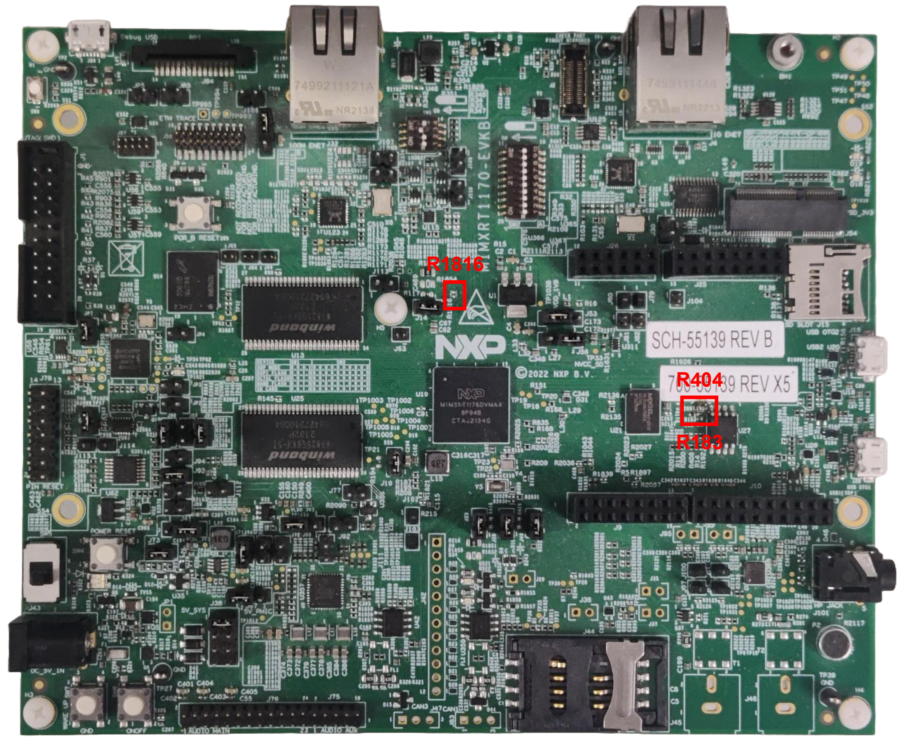
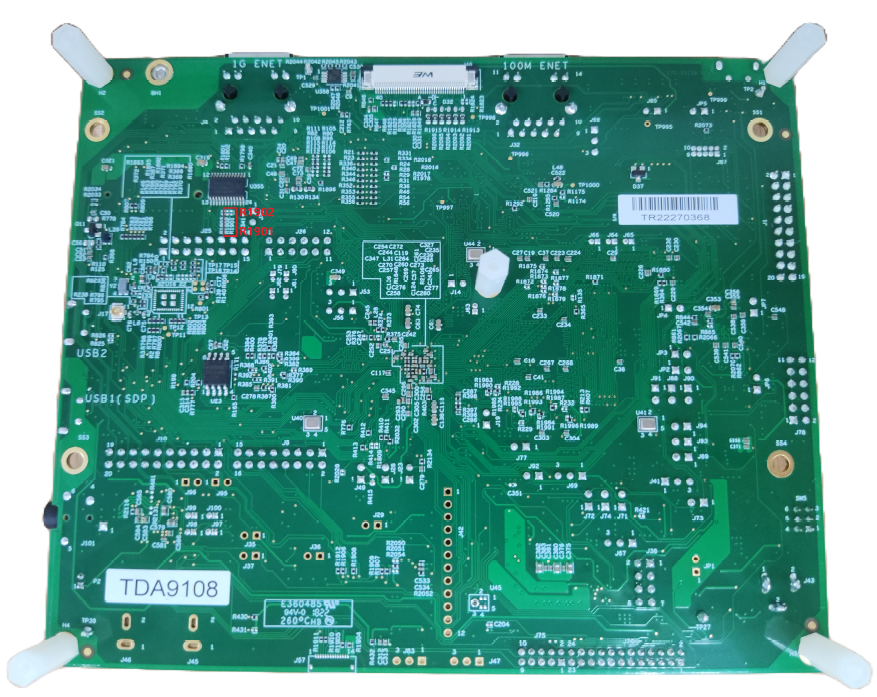
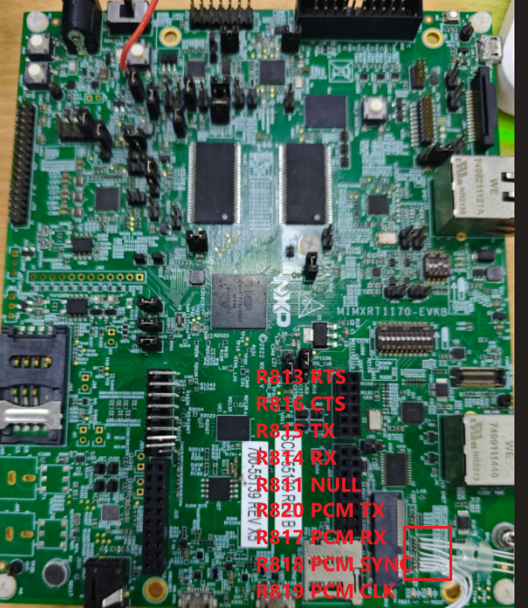
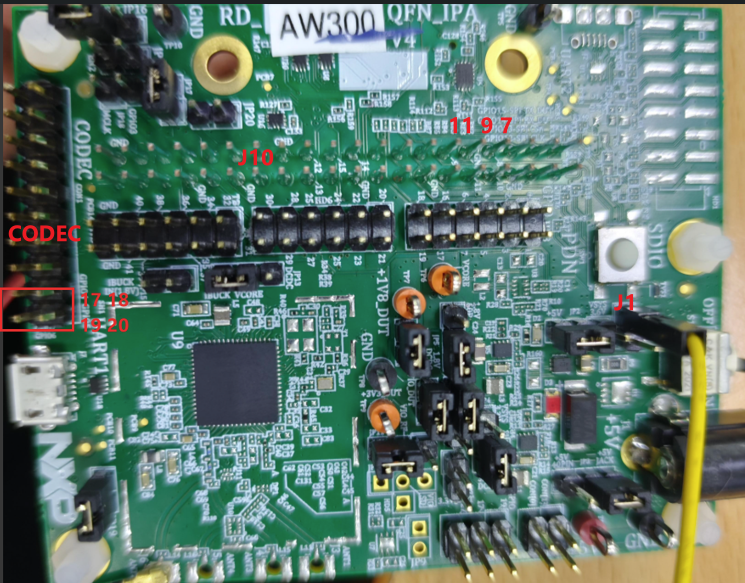
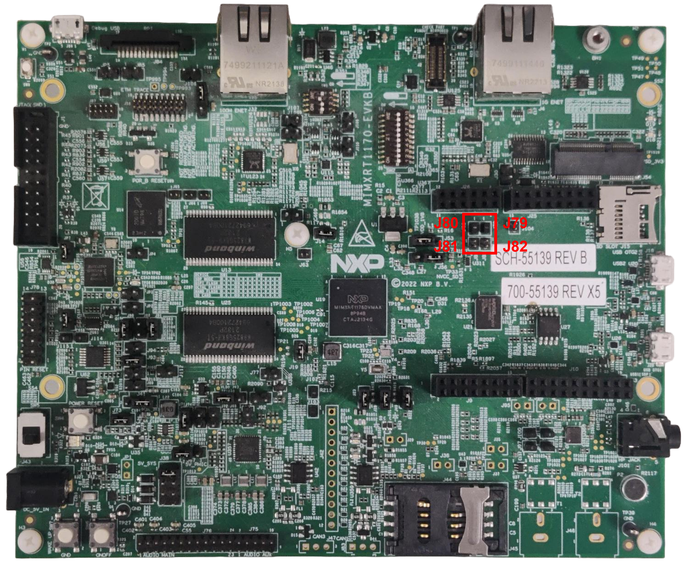
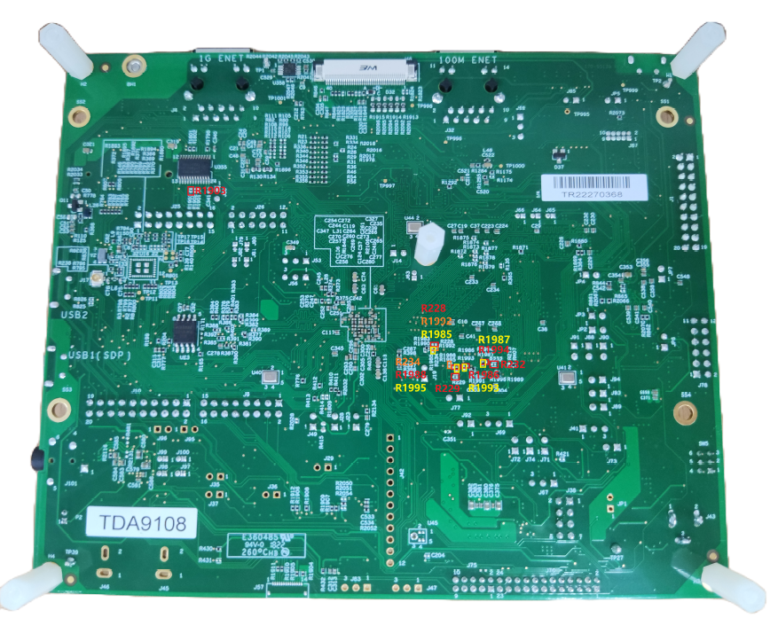
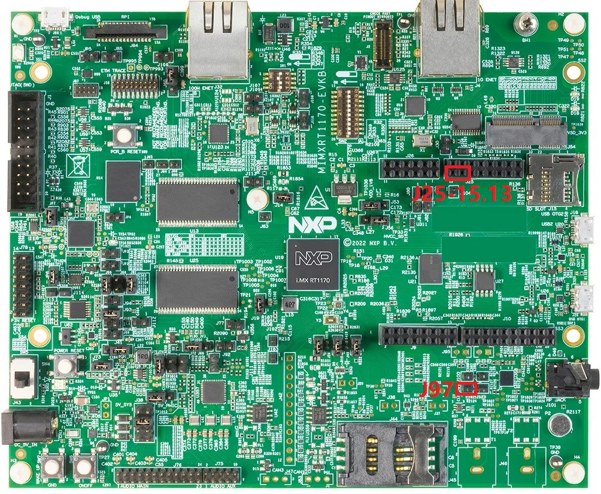

# Hardware rework 

-   **HCI UART rework**
    1.  Remove resistors R183 and R1816.
    2.  Solder 0 ohm resistor to R404, R1901, and R1902.

        

        

        

        

    |AW300          |i.MX RT1170-EVKB pin|Pin name of 1170-EVKB|
    |--------       |------------------- |-------------------- |
    |J10 \(pin 10\)|R814 RX|LPUART2\_RXD
    |J10 \(pin 8\)|R815 TX|LPUART2\_TXD
    |J10 \(pin 11\)|R816 CTS|LPUART2\_CTS
    |J10 \(pin 7\)|R813 RTS|LPUART2\_RTS
    |J10 \(pin 9\)|J10 \(pin 11\)|GND|
    |JP1          |J10 \(pin 10\)|power sync|

-   **PCM interface rework**
    1.  Disconnect header J79 and J80.
    2.  Connect header J81 and J82.
    3.  Remove resistors R1985, R1986, R1987, R1988, R1992, R1993, R1994, and R1995.
    4.  Solder 0 ohm resistor to R228, R229, R232, R234, and R1903.

        

        

    |AW300          |i.MX RT1170-EVKB pin|Pin name of 1170-EVKB|
    |--------       |------------------- |-------------------- |
    |CODEC \(pin 20\)|R817 RX  |PCM_IN  |
    |CODEC \(pin 19\)|R820 TX  |CPM_OUT |
    |CODEC \(pin 18\)|R818 CLK |PCM_CLK |
    |CODEC \(pin 17\)|R819 SYNC|PCM_SYNC|

-   LE Audio Synchronization interface rework \(only used on sink side\)
    1.  Connect J25-15 with J97.
    2.  Connect J25-13 with 2EL's GPIO\_27

        

    |AW300          |i.MX RT1170-EVKB pin
    |--------       |------------------- |
    |HD6 \(8\)|J25 13  |

**Parent topic:**[Hardware Rework Guide for MIMXRT1170-EVKB and AW300](../topics/MIMXRT1170-EVKB_AW300.md)

