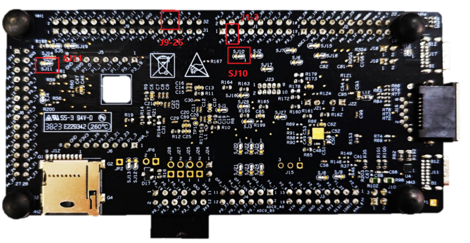
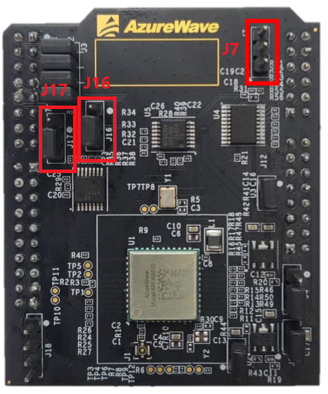

# Hardware Rework Guide for FRDM-MCXN947 and FRDM-IW416-AW-AM510

This section is a brief hardware rework guidance of the EdgeFast Bluetooth PAL on the NXP FRDM-MCXN947 board and FRDM-IW416-AW-AM510 board. The hardware rework consists of two parts:

-   UART interface rework
-   FRDM-IW416-AW-AM510

## Hardware rework 

-   UART interface rework
    -   Remove SJ11 1-2, connect SJ11 2-3
    -   Remove SJ10 1-2, connect J1-3 to J9-26

-   FRDM-IW416-AW-AM510 jumper setting
    -   Connect J16 2-3 for 3.3V supply
    -   Connect J17 2-3 for 3.3V UART voltage level
    -   Connect J7 2-3 for 3.3V SDIO voltage level
    
    

