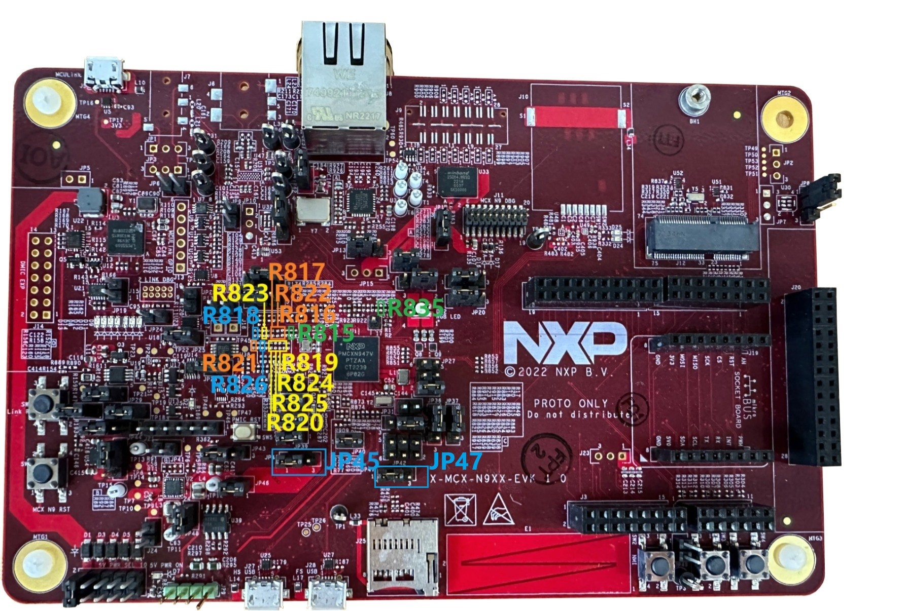

# Hardware Rework Guide for MCXN947-EVK and Murata M.2 Module

This section is a brief hardware rework guidance of the EdgeFast Bluetooth PAL on the NXP MCXN947-EVK board and the Murata’s 1XK, 1ZM or 2LL solution - direct M.2 connection to Embedded Artists EAR00385 \(1XK\), EAR00364 \(1ZM\) or EAR00500 \(2LL\) M.2 modules.

The hardware rework consists of two parts:

-   M.2 UART interface
-   M.2 SDIO interface

## Hardware rework 

-   M.2 UART interface rework
    -   Mount R835
    -   Connect JP45 2-3 to supply 1.8V for GPIO4
-   M.2 SDIO interface rework
    -   Connect JP47 2-3 to supply 1.8V for GPIO2
    -   Remove R818, connect R823
    -   Remove R819, connect R824
    -   Remove R817, connect R822
    -   Remove R815, connect R816
    -   Remove R820, connect R825
    -   Remove R821, connect R826
    

